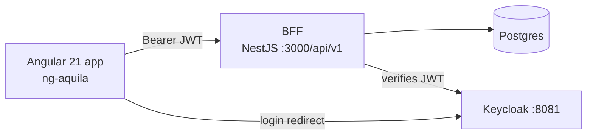
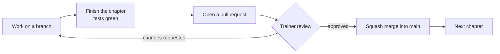

# Contract Management – Frontend Training

Build an Angular 21 frontend for the contract management BFF, one feature per chapter.

## Chapters

| # | Chapter | You build |
|---|---------|-----------|
| 0 | [Business knowledge](chapters/00-business-knowledge.md) | Roles, contract flow and BFF endpoints |
| 1 | [Setup prerequisites](chapters/01-setup-prerequisites.md) | WSL, Podman, Node, the running BFF and the UI project with ESLint, Prettier and git hooks |
| 2 | [Setup Angular and ng-aquila](chapters/02-setup-ng-aquila.md) | Empty app with ng-aquila theme |
| 3 | [Generate the models](chapters/03-generate-models.md) | TypeScript models generated from the BFF Swagger file |
| 4 | [Internationalization](chapters/04-i18n.md) | English and German texts, language switch |
| 5 | [Login](chapters/05-login.md) | Keycloak login, token in localStorage |
| 6 | [Contract list](chapters/06-contract-list.md) | Homepage with search |
| 7 | [Create a contract](chapters/07-create-contract.md) | Draft form and contract page with stepper |
| 8 | [Premium calculation](chapters/08-premium-calculation.md) | Draft step: premium and move to offer |
| 9 | [Document upload](chapters/09-document-upload.md) | Offer step: documents |
| 10 | [Sign the contract](chapters/10-sign-contract.md) | Signed step, errors, read-only contract |
| 11 | [Claude Code setup](chapters/11-claude-code-setup.md) | CLAUDE.md, settings, skills and MCP servers |
| 12 | [Admin resources](chapters/12-admin-resources-ngrx.md) | Beneficiaries and insured objects with NgRx |
| 13 | [Auth library](chapters/13-auth-library.md) | Refactor: generic auth logic and header moved into a library |

## Technical rules

| Rule | Meaning |
|------|---------|
| Standalone | No NgModules |
| OnPush | Every component uses OnPush change detection |
| Signals | UI state in signals |
| HttpClient | One service per BFF resource; components never call HttpClient |
| Services, interceptor, directives | Logic in services, cross-cutting in the interceptor, reusable UI behaviour in directives |
| i18n | All texts translated with ngx-translate, English and German |
| ng-aquila | UI components come from ng-aquila |
| NgRx | Only beneficiaries and insured objects. Contracts do not use NgRx |
| Code quality | ESLint (added with the Angular generator) and Prettier on every file |
| Git hooks | Use and enforce git hooks, managed with [husky](https://typicode.github.io/husky/): staged files are linted and formatted before every commit, and commit messages must follow Conventional Commits. Never skip the hooks |
| Tests | Every chapter ends with tests |

## Prerequisites

| Need | Version |
|------|---------|
| Windows | With WSL |
| Podman | Installed inside WSL |
| Node.js | v24 or newer, installed on Windows |
| JDK | Java 11 or newer, installed on Windows, for the OpenAPI Generator |
| Git | Current |

## Working mode

| Rule | Meaning |
|------|---------|
| One pull request per chapter | Work on a branch per chapter and open a pull request when the chapter is done and its tests are green |
| Wait for the review | Do not start the next chapter before the trainer has reviewed the pull request. Fix requested changes on the same branch |
| Squash merge | The trainer merges with **squash merge**, so every chapter becomes one commit on `main` |
| Conventional Commits title | The pull request title must follow [Conventional Commits](https://www.conventionalcommits.org/en/v1.0.0/), because it becomes the commit message on `main`. Example: `feat(login): add keycloak login with angular-oauth2-oidc` |
