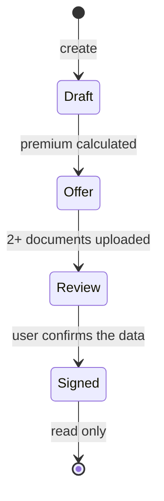

# 0. Business knowledge

## Users and roles

| Action | Broker | Superadmin |
|--------|:------:|:----------:|
| View contracts, documents, beneficiaries, insured objects | yes | yes |
| Create contracts | yes | yes |
| Upload, download documents | yes | yes |
| Calculate premium | yes | yes |
| Move a contract to the next stage | yes | yes |
| Delete a contract | no | yes |
| Create, update, delete beneficiaries | no | yes |
| Create, update, delete insured objects and their contract type mapping | no | yes |

Demo users: `broker` / `broker`, `admin` / `admin` (superadmin).

## Contract flow

Stages only move forward, one step at a time.

| Step | What the user provides | Checks |
|------|------------------------|--------|
| Create (Draft) | Name, contract type (life or non-life), beneficiary | Contract type cannot be changed afterwards |
| Calculate premium | Nothing | Premium is calculated by the BFF from the insured objects of the contract type; the user cannot enter it |
| Draft to Offer | Only the target stage | Premium must be calculated |
| Add documents | A pdf or docx file | Only in Offer, max 10 MB |
| Offer to Review | Only the target stage | Premium calculated and at least 2 documents |
| Review to Signed | Only the target stage (the user first confirms that all data is valid) | Premium calculated. This is the final transition |
| Review and Signed | Nothing | No more changes: no uploads, no document removal, no premium recalculation |

Insured objects are managed by a superadmin. Each one lists the contract types it applies to. A contract shows the insured objects of its type; they cannot be edited from the contract.

## BFF endpoints

Base URL `http://localhost:3000/api/v1`, Swagger at `http://localhost:3000/api`.

| Endpoint | Who | Purpose |
|----------|-----|---------|
| `GET /contracts`, `GET /contracts/:id` | both | List, details with beneficiary, documents, insured objects |
| `POST /contracts` | both | Create a Draft contract |
| `POST /contracts/:id/calculate-premium` | both | Calculate and save the premium |
| `POST /contracts/:id/transitions` | both | Move to the target stage |
| `GET /contracts/:id/documents` | both | List documents |
| `POST /contracts/:id/documents` | both | Upload a document |
| `GET /contracts/:id/documents/:docId/content` | both | Download a document |
| `DELETE /contracts/:id` | superadmin | Delete a contract |
| `/beneficiaries` | read: both, write: superadmin | CRUD |
| `/insured-objects` | read: both, write: superadmin | CRUD |
