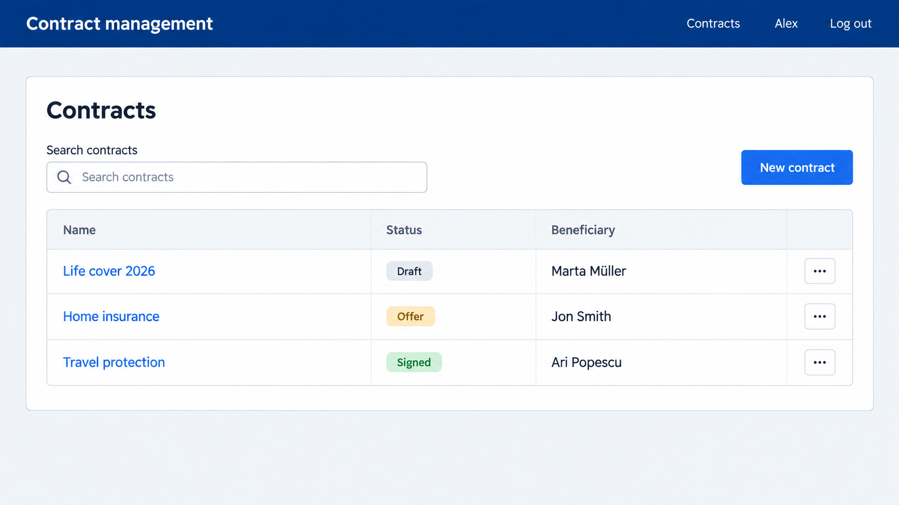

# 6. Contract list

## Read

- [Angular Signals](https://angular.dev/guide/signals)
- [Angular University Signals](https://blog.angular-university.io/angular-signals/)
- [Rainer Hahnekamp: Modern Change Detection](https://www.youtube.com/watch?v=54o9eSGjfW4)
- [Rainer Hahnekamp: Modern Testing in Angular](https://www.youtube.com/watch?v=lbiOP-VLKGI)
- [Rainer Hahnekamp: Signals Full Guide](https://youtu.be/6W6gycuhiN0)
- [Angular DI](https://angular.dev/guide/di)

## Practice

Implement:

| What | Business description |
|------|----------------------|
| Contracts service | One service for BFF calls on contracts. For now: list and get one |
| Homepage | A table of all contracts with name, status and beneficiary |
| Search | A field above the table. The list narrows while typing, matching contract name or beneficiary name, ignoring case |
| Empty state | A translated message when nothing matches |
| Navigation | Each name opens the contract page and a button starts a new contract (both pages follow in the next chapter) |
| Translations | All new texts in English and German |

Check the three seeded contracts and try searching for `life`.

## Visual mockup

## Tests

- The service requests the contract list
- The page shows every contract
- Typing in the search field reduces the rows to the matching contracts

Done when the list and the search work and the tests are green.

## Be able to explain

- How testing works (problems, how mocks for tests will be maintained across the app)
- How signals work (DI, Change Detection, argues over usecases, usage in testing, when will you use a computed, linkedSignal or effect)
