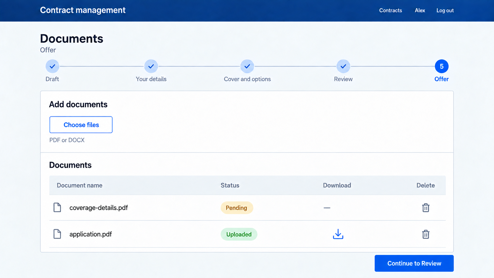

# 9. Document upload

## Read

- [RxJS overview](https://rxjs.dev/guide/overview)
- [forkJoin](https://rxjs.dev/api/index/function/forkJoin)
- [concatMap](https://rxjs.dev/api/operators/concatMap)
- [switchMap](https://rxjs.dev/api/operators/switchMap)
- [catchError](https://rxjs.dev/api/operators/catchError)

## Practice

Implement on the Offer step:

| What | Business description |
|------|----------------------|
| Service calls | Upload a document to a contract and download a document. The BFF accepts one file per upload request |
| File selection directive | A reusable directive for a file input that reports the chosen file and clears the input |
| Choosing files | A file picker that accepts only pdf and docx. A chosen file is **not** sent to the BFF; it is kept in browser memory in a signal. Documents can only be added while the contract is in Offer |
| Documents table | Shows both files in memory and documents already stored in the BFF in one table. Each row has the document name, a status (`Pending` for files in memory or `Uploaded` for stored documents), a download icon and a delete icon. The download icon is enabled only for uploaded documents; deleting a pending document removes it from memory. Files in memory are lost when the page is reloaded |
| Continue button | Disabled until the stored documents plus the files in memory are at least 2. Pressing it runs the flow below and moves the contract to Review |
| Visibility | The file picker and the continue button only exist while the contract is in Offer; the documents table stays visible afterwards. The pending-document delete action only exists while the contract is in Offer |
| Translations | All new texts in English and German |

The flow, managed with RxJS:

| Step | Business description |
|------|----------------------|
| 1 | Send one upload request for every file in memory |
| 2 | Wait until **all** uploads have finished. Combine them into one stream that completes only when every upload is done (see `forkJoin`, or `concatMap` to send them one after another) |
| 3 | Only then call the transition endpoint with the target stage Review. Chain it after the uploads (see `switchMap`) so it never starts earlier |
| 4 | When everything succeeds, clear the files from memory and show the contract returned by the transition. Its status is Review, so the stepper moves to the review step. The final signing is the next chapter |
| Failure | If an upload fails, do not call the transition. Show the BFF message (see `catchError`). Files that were already uploaded are removed from memory so a retry does not upload them twice; the failed ones stay |
| While running | Disable the continue button and the file picker so the flow cannot be started twice |
| Nothing to upload | When all documents are already stored and nothing is in memory, the button only calls the transition |

Choose two files, remove one and add another, then continue. Watch the network tab: one upload request per file, and the transition request starts only after the last upload has finished.

## Visual mockup

## Tests

- The service uploads a file as a multipart form
- The directive reports the chosen file
- A chosen file is kept in memory and no request is sent
- A pending file can be deleted from the documents table
- An uploaded document can be downloaded using its download icon
- Continue is disabled with one document in total, enabled with two
- Continuing sends one upload request per file and sends the Review transition only after all uploads have been answered
- If an upload fails, no transition request is sent and the message is shown
- After a successful flow the memory list is empty

Done when files wait in memory until the continue button uploads them all and moves the contract to Review, and the tests are green.

## What to explain

- RxJs operator orchestration
