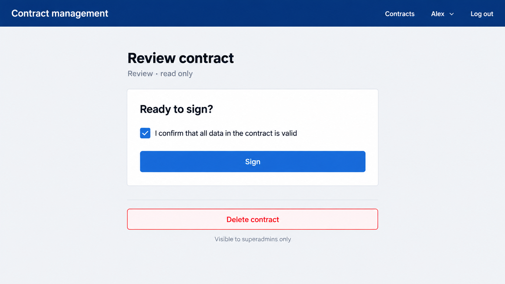

# 10. Sign the contract

## Read

- nothing new here

## Practice

Implement on the Review step:

| What | Business description |
|------|----------------------|
| Service call | Delete a contract (the transition call already exists from chapter 8) |
| Confirmation | On the Review step, a checkbox (ng-aquila) with the text "I confirm that all data in the contract is valid" |
| Sign button | Disabled until the checkbox is ticked. Pressing it calls the transition endpoint with the target stage Signed. This is the actual last transition of the contract |
| Review is read only | In Review the user can only confirm and sign: no upload, no calculate, no document removal |
| After signing | The stepper shows the signed step as completed and a message says the contract is signed and can no longer be changed |
| Signed is read only | In Signed no action is shown: no checkbox, no sign, no upload, no calculate |
| Error messages | When the BFF refuses an action (a failed upload in chapter 9 or a refused transition), show its message above the stepper in an ng-aquila message. A successful action clears it |
| Delete | A delete button only for superadmins (use the role directive). After deleting, return to the contract list |
| Translations | All new texts in English and German |

Test as `broker` (no delete button) and as `admin`.

## Visual mockup

## Tests

- The sign button is disabled until the checkbox is ticked
- Ticking the checkbox and pressing sign sends the Signed transition
- A refused action shows the BFF message
- A contract in Review shows only the checkbox and the sign button
- A signed contract shows no action buttons, no checkbox and no upload
- The delete button is hidden for a broker

Done when a contract can be taken from Draft to Signed, errors are visible, and the tests are green.

## What you will see

| Step | What appears |
|------|--------------|
| Offer step, after continue | The stepper moves to the Review step. The checkbox is unticked and the sign button is disabled |
| Tick the checkbox | The sign button is enabled |
| Press sign | The contract becomes Signed: the stepper is complete and the signed message appears; no actions are left |
